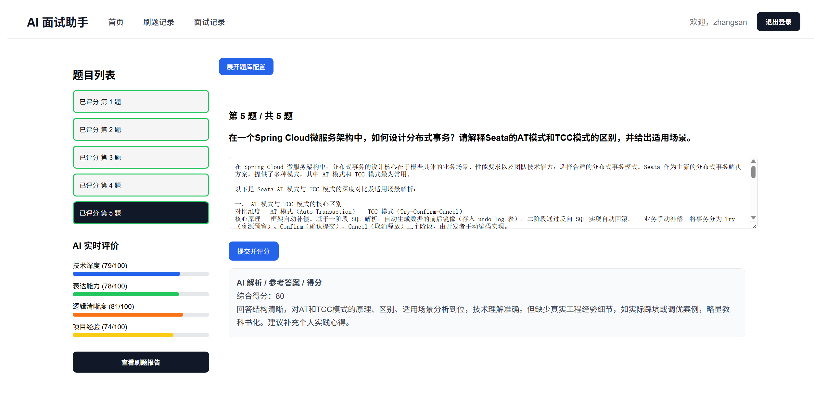
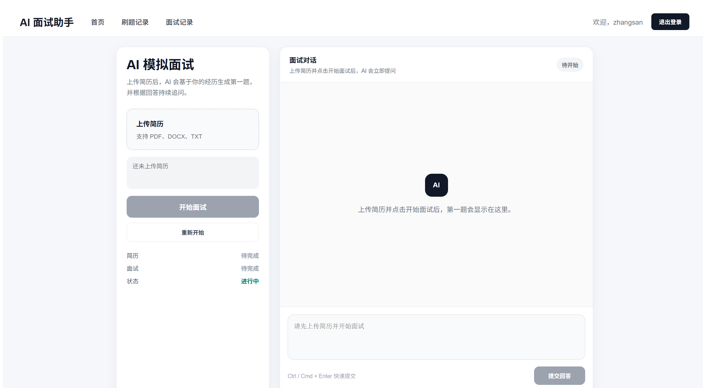
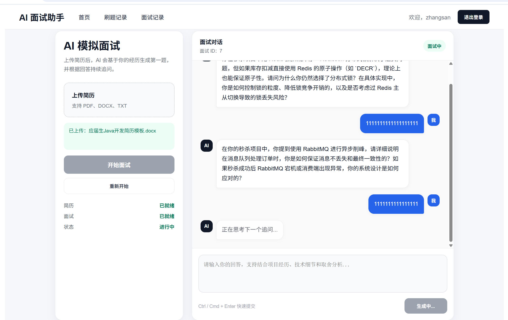
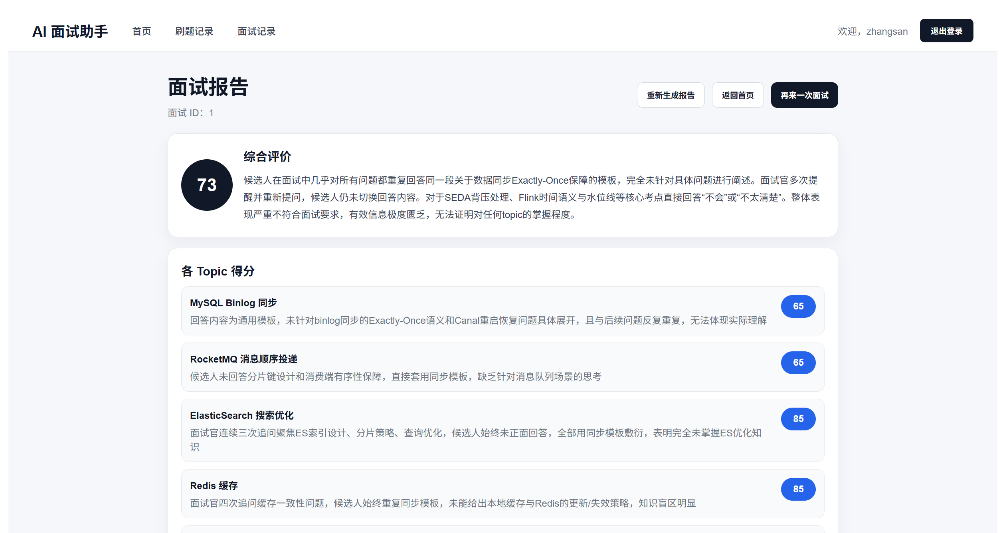
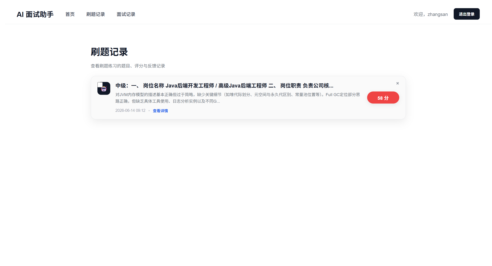
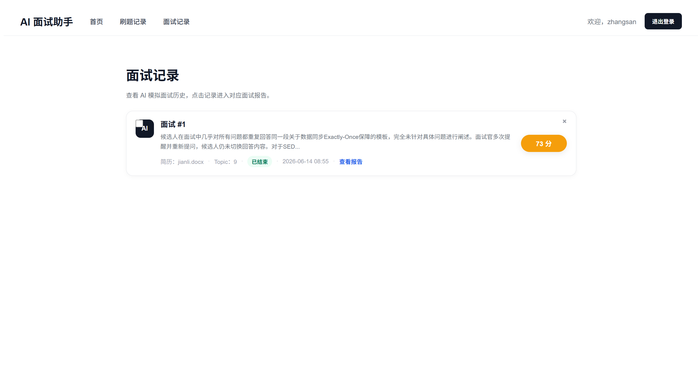
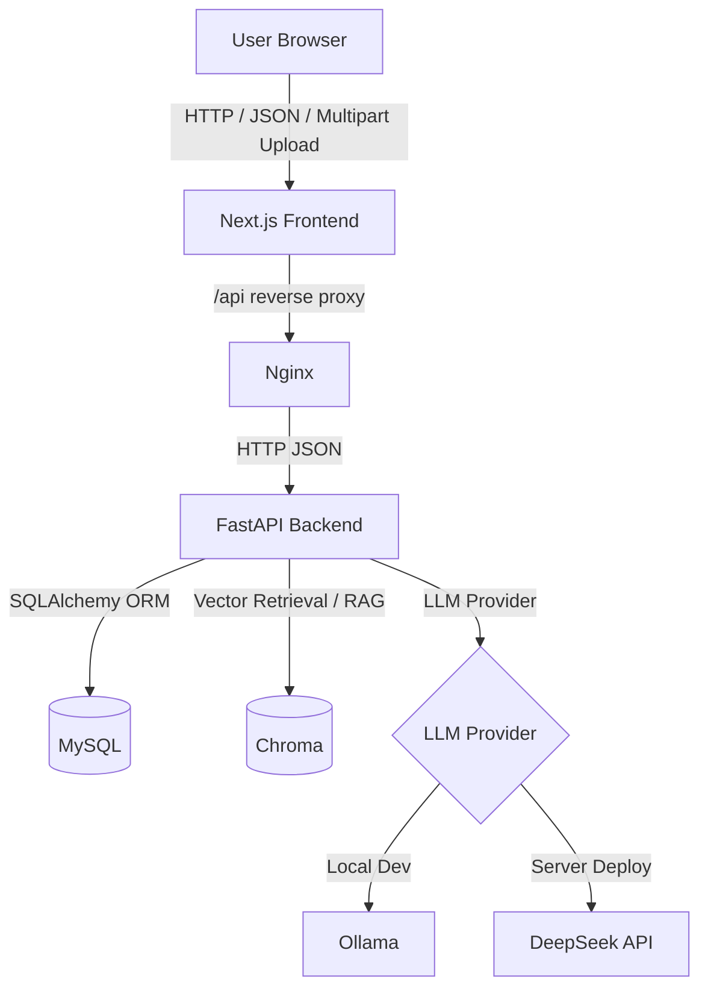
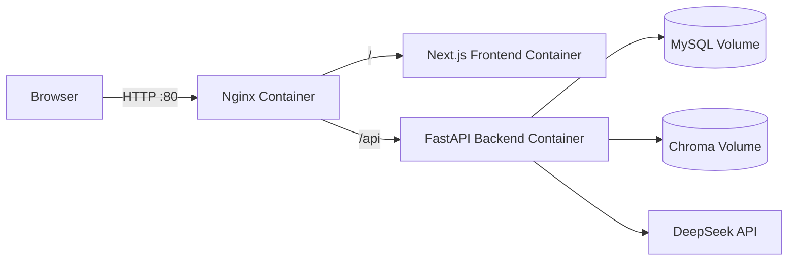

# AI 面试助手（AI Interview Assistant）

> 一个面向求职者的 AI 面试与刷题训练系统，覆盖刷题练习、简历解析、AI 模拟面试、多轮追问、Topic 动态切换、结构化面试报告和历史记录复盘。

本项目定位为 **AI 应用开发岗位作品集项目**。它不是简单的大模型调用 Demo，而是围绕真实面试准备场景，完整实现了前端交互、后端服务、LLM 编排、用户鉴权、数据持久化、Docker Compose 部署和 Nginx 反向代理等工程能力。

## 功能截图

### 刷题练习


### AI模拟面试


### 多轮追问机制


### 面试报告


### 刷题记录


### 面试记录


## 核心功能

- **刷题练习**：根据题库、题型和技术方向生成题目，支持提交答案、AI 评分、解析反馈和刷题记录保存。
- **AI 模拟面试**：上传 PDF / DOCX / TXT 简历后，AI 基于简历内容生成第一题并持续追问。
- **多轮追问机制**：结合候选人回答质量动态决定继续追问或切换 Topic，避免固定追问次数导致体验僵硬。
- **Topic 动态切换**：LLM 判断 + 代码兜底，支持优秀回答提前切换、不会回答快速跳过、最多追问次数保护。
- **面试报告**：面试结束后生成综合评分、Topic 得分、优势、不足、改进建议和复习计划。
- **历史记录闭环**：支持刷题记录、面试记录、报告详情查看与删除。
- **用户鉴权**：基于 JWT 的登录注册与接口保护，确保不同用户的数据隔离。

## 系统架构图



## 技术栈

| 模块 | 技术 |
| --- | --- |
| Frontend | Next.js 16、React 19、TypeScript、Playwright |
| Backend | FastAPI、Python、SQLAlchemy、Pydantic |
| Auth | JWT、HTTP Bearer Token |
| Database | MySQL |
| AI / LLM | LangChain、Prompt Engineering、DeepSeek API、Ollama |
| RAG | Chroma、Embedding Retriever |
| Deploy | Docker、Docker Compose、Nginx |
| Test | pytest、Playwright E2E |

## 项目亮点

### LLM Provider 设计

后端通过统一的 `llm_service` 抽象 LLM 调用，支持通过环境变量切换：

```env
LLM_PROVIDER=ollama
LLM_PROVIDER=deepseek
```

本地开发可以使用 Ollama，服务器部署可以切换为 DeepSeek API，避免低配置服务器部署本地大模型。

### DeepSeek API 接入

服务端使用 OpenAI SDK 兼容格式接入 DeepSeek API，API Key 只通过环境变量配置，不写死在代码中：

```env
DEEPSEEK_API_KEY=your_deepseek_api_key
DEEPSEEK_BASE_URL=https://api.deepseek.com
DEEPSEEK_MODEL=deepseek-v4-flash
```

### JWT 鉴权与数据隔离

登录后前端保存 token，后端通过 JWT 校验用户身份。刷题记录、面试记录、报告查询都按当前用户过滤，避免用户之间互相看到数据。

### Docker Compose 部署

项目提供 Docker Compose 部署方案，包含：

- frontend
- backend
- mysql
- nginx

服务器默认使用 DeepSeek API，不包含 Ollama 服务，适合低内存 Debian / Ubuntu 服务器部署。

### Nginx 反向代理

Nginx 统一暴露 80 端口：

- `/` 转发到 Next.js frontend
- `/api` 转发到 FastAPI backend

前端生产环境默认请求相对路径 `/api`，避免 Docker 部署后仍访问 `127.0.0.1:8000`。

### 多轮追问机制

AI 面试不是简单问答，而是根据候选人的回答质量动态控制面试流：

- 回答优秀：提前切换 Topic
- 回答一般：继续追问
- 明确不会：快速切换 Topic
- 无效回答：低分并避免无意义追问
- 最多追问次数：代码兜底保护

## 技术难点与解决方案

### 1. LLM 输出不稳定

**问题**：模型可能返回 Markdown、自然语言或非法 JSON，直接解析会导致接口异常。

**解决方案**：

- Prompt 中明确要求输出合法 JSON。
- 后端增加 JSON 提取与解析兜底。
- 解析失败时使用保守策略，避免面试流程崩溃。

### 2. Topic 切换体验僵硬

**问题**：固定追问次数会导致候选人不会时仍被追问，体验不自然。

**解决方案**：

- LLM 输出 `action`、`score`、`reason`、`next_question`。
- 代码层根据分数、追问次数、cannot_answer 检测做最终决策。
- `MAX_FOLLOW_UP=3` 做兜底保护。

### 3. “不会”误判

**问题**：“不会一直查库”这类正常技术表达可能被误判为候选人不会。

**解决方案**：

- 只在短回答且主要表达“不知道/不会/没接触过”时判定 cannot_answer。
- 如果回答包含 Redis、缓存、数据库、接口、方案、优化等技术关键词，则不误杀。

### 4. 报告评分不能完全依赖 LLM

**问题**：全是无效回答时，LLM 仍可能生成偏高分或虚假优点。

**解决方案**：

- Topic 分数优先来自面试过程中的评分。
- 无效数字、重复字符、无语义回答强制低分。
- 综合评分结合 Topic 平均分、完整度和回答稳定性。
- 低分报告隐藏或弱化“优点”。

### 5. Docker 部署下前端接口地址错误

**问题**：前端写死 `http://127.0.0.1:8000`，部署后浏览器会请求用户本机而不是容器后端。

**解决方案**：

- 统一封装 `lib/api.ts`。
- 本地开发可配置 `NEXT_PUBLIC_API_BASE_URL=http://127.0.0.1:8000`。
- Docker 生产默认 `NEXT_PUBLIC_API_BASE_URL=/api`。
- Nginx 将 `/api` 转发到 backend。

## 部署架构



## 快速开始

### 1. Clone 项目

```bash
git clone https://github.com/likekongfu/ai-interview-assistant.git
cd ai-interview-assistant
```

### 2. 后端本地启动

```bash
cd backend
pip install -r requirements.txt
uvicorn main:app --reload
```

接口文档：

```text
http://127.0.0.1:8000/docs
```

### 3. 前端本地启动

```bash
cd frontend
npm install
npm run dev
```

访问：

```text
http://localhost:3000
```

本地前端环境变量示例：

```env
NEXT_PUBLIC_API_BASE_URL=http://127.0.0.1:8000
```

## Docker Compose 启动

复制环境变量：

```bash
cp .env.example .env
```

修改 `.env` 中的数据库密码、`SECRET_KEY` 和 `DEEPSEEK_API_KEY`，然后启动：

```bash
docker compose up -d --build
```

查看日志：

```bash
docker compose logs -f
```

停止服务：

```bash
docker compose down
```

## 环境变量

核心变量：

```env
SECRET_KEY=change-me

DB_HOST=mysql
DB_PORT=3306
DB_USER=ai_interview
DB_PASSWORD=your-password
DB_NAME=ai_interview

LLM_PROVIDER=deepseek
DEEPSEEK_API_KEY=your_deepseek_api_key
DEEPSEEK_BASE_URL=https://api.deepseek.com
DEEPSEEK_MODEL=deepseek-v4-flash

OLLAMA_BASE_URL=http://localhost:11434
OLLAMA_MODEL=qwen2.5:7b

NEXT_PUBLIC_API_BASE_URL=/api
MAX_FOLLOW_UP=3
```

## 测试

后端：

```bash
cd backend
python -m pytest
```

前端：

```bash
cd frontend
npm run build
npm run test:e2e
```

## 技术能力覆盖

本项目覆盖以下工程实践：

- FastAPI 后端服务设计与接口开发
- JWT 鉴权与多用户数据隔离
- MySQL 数据建模与 SQLAlchemy ORM
- LangChain 编排与 Prompt Engineering
- DeepSeek API 集成与 LLM Provider 抽象
- Chroma 向量检索与 RAG 基础架构
- Docker Compose 容器化部署
- Nginx 反向代理与统一入口设计
- Playwright E2E 自动化测试
- AI 面试场景下的多轮对话状态管理
