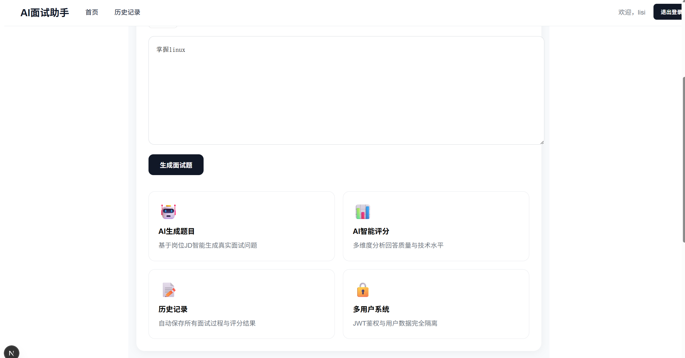
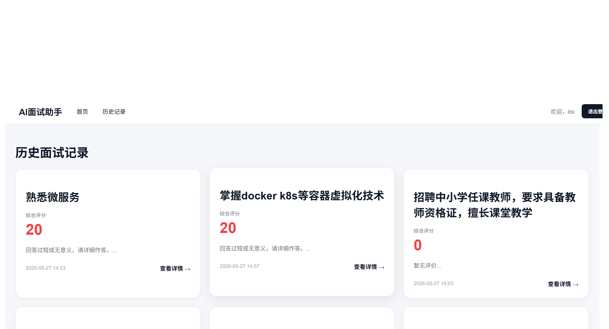
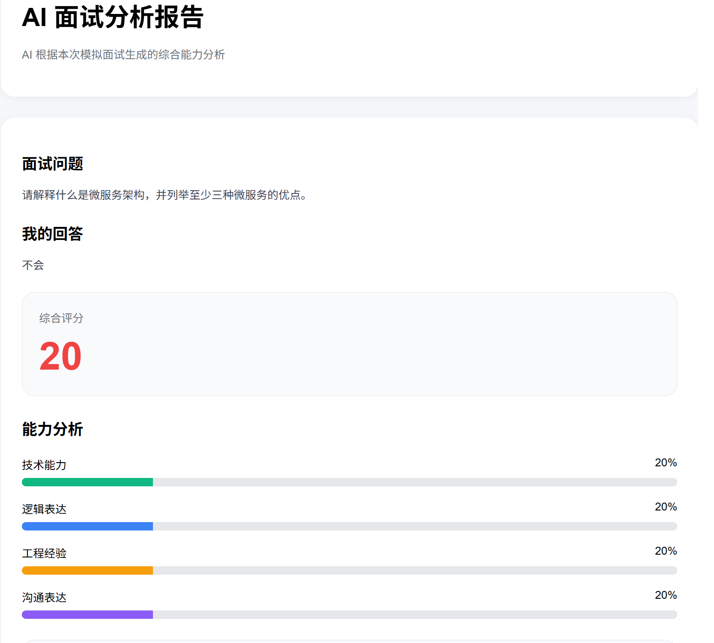

# 🤖 AI 面试助手 (AI Interview Assistant)

> 一款基于大语言模型的面试模拟与智能评估工具，帮助开发者高效准备面试、生成岗位定制化题目并获得多维度反馈。

## ✨ 核心亮点

- **📝 历史复盘**：自动保存所有面试过程与评分结果，方便随时回顾与提升。
- **🔒 多用户系统**：采用 JWT 鉴权机制，确保用户数据完全隔离，保障隐私安全。
- **🧠 智能出题**：根据目标岗位自动生成定制化面试题，告别盲目刷题。
- **💬 实时交互**：流畅的对话体验，高度还原真实面试场景。

---

## 📸 功能截图

### 1. 首页 & 面试模拟

*清晰的仪表盘设计，一键开启模拟面试。*

### 2. 历史面试记录

*完整保留过往面试详情，支持随时回溯查看。*

### 3. 智能评分详情

*多维度能力雷达图与针对性改进建议。*

---

## 🛠️ 技术栈

本项目采用前后端分离架构，核心技术选型如下：

| 模块 | 技术选型 | 说明 |
| :--- | :--- | :--- |
| **前端** | Next.js | React 全栈框架，提供极致的 SSR/SSG 体验 |
| **后端** | FastAPI + Python | 高性能异步 Web 框架，适合 AI 密集型任务 |
| **AI 能力** | LLM API | 接入大语言模型接口，驱动核心业务逻辑 |
| **数据库** | MySQL / Redis | 关系型数据存储 + 高速缓存会话/Token |
| **鉴权** | JWT | JSON Web Token 令牌认证，保障接口安全 |

---

## 🚀 快速开始

### 1. 克隆项目

```bash
git clone https://gitee.com/likekongfu/myai_project.git
cd myai_project
