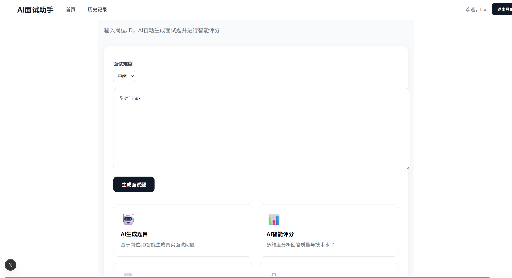
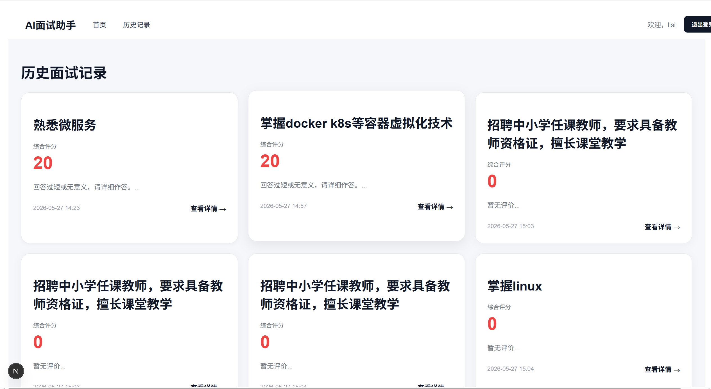
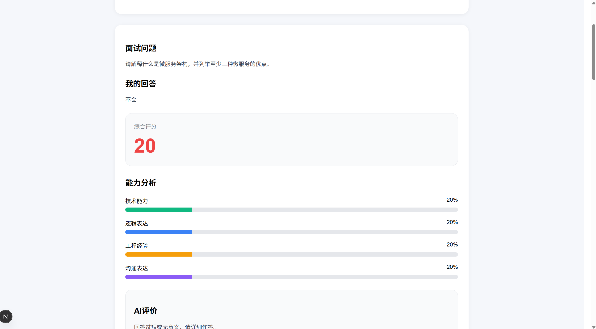

# AI 面试助手 🤖💼

一款基于大语言模型的面试模拟与智能评估工具，帮助开发者高效准备面试、生成岗位定制化题目并获得多维度反馈。

---

## ✨ 项目亮点

- 🎯 **AI 生成题目**：基于岗位 JD 智能生成真实面试问题，告别盲目刷题
- 🤖 **AI 智能评分**：多维度分析回答质量，提供技术水平与逻辑表达反馈
- 📝 **历史记录**：自动保存所有面试过程与评分结果，方便复盘提升
- 🔐 **多用户系统**：JWT 鉴权与用户数据完全隔离，保障隐私安全

---

## 📸 功能截图

### 首页 & 面试模拟


### 历史面试记录


### 智能评分详情


---

## 🛠️ 技术栈

| 模块       | 技术选型                  |
|------------|---------------------------|
| 前端       | Next.js + Tailwind CSS    |
| 后端       | FastAPI + Python          |
| AI 能力    | 大语言模型接口            |
| 数据库     | SQLite / PostgreSQL       |
| 鉴权       | JWT 令牌认证              |

---

## 🚀 快速开始

### 1. 克隆项目
```bash
git clone https://github.com/你的用户名/ai-interview-assistant.git
cd ai-interview-assistant