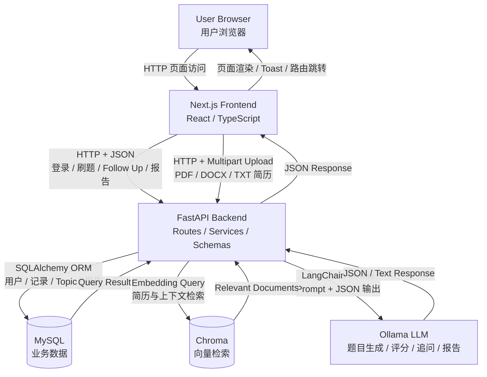
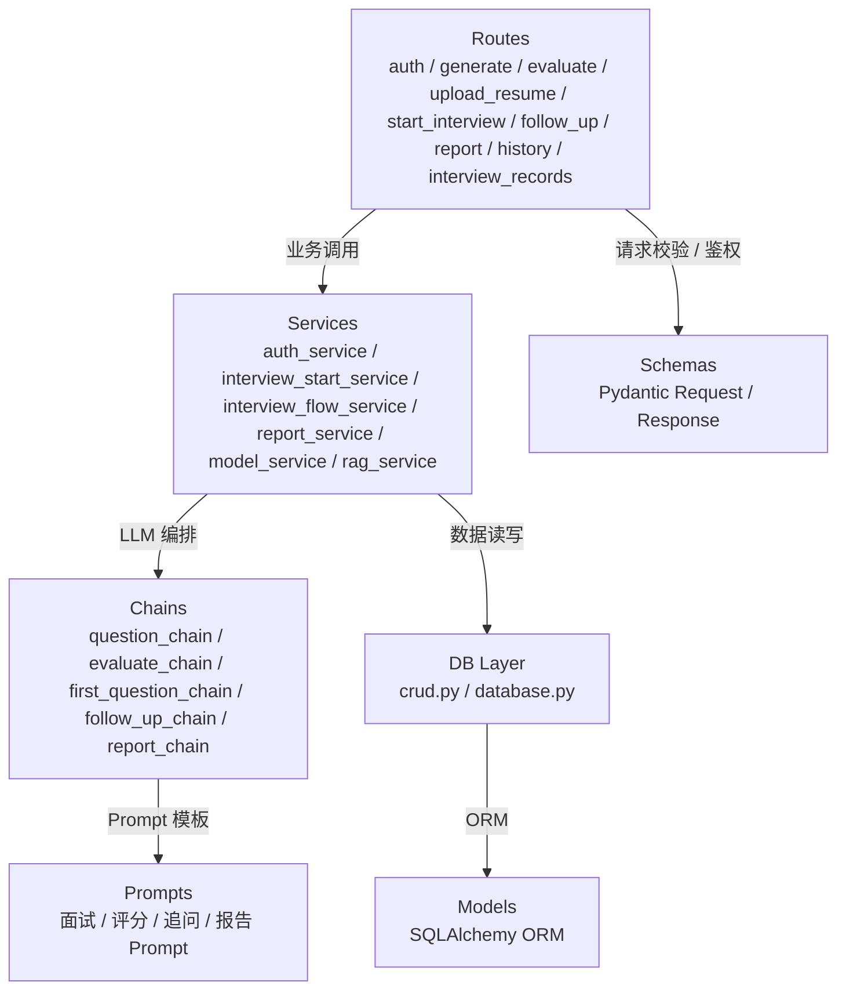
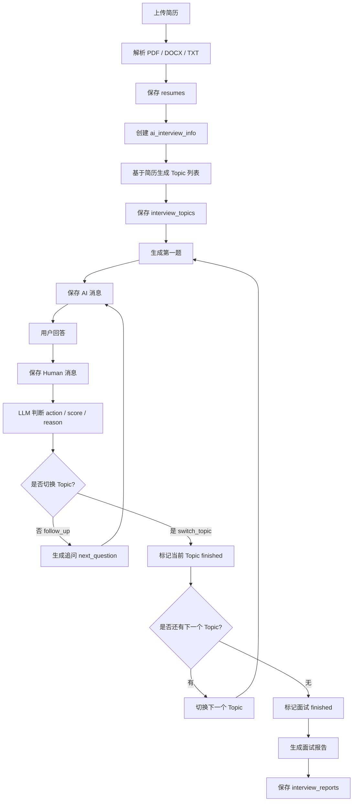
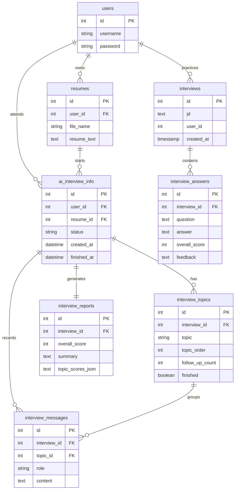

# 系统架构文档

## 系统架构图



## 后端分层图



## AI 面试流程图



## 刷题流程图

```mermaid
flowchart TD
    A[进入刷题页] --> B[输入题库 / 题型 / 技术方向]
    B --> C[POST /generate_questions]
    C --> D[创建 interviews 刷题记录]
    D --> E[LLM 生成题目列表]
    E --> F[前端展示题目]
    F --> G[用户输入答案]
    G --> H[POST /evaluate_answer]
    H --> I[AI 评分]
    I --> J[保存 interview_answers]
    J --> K[展示解析 / 参考答案 / 得分]
    K --> L[进入刷题记录 /history]
    L --> M[查看详情 /history/{id}]
    M --> N[删除记录]
```

## Topic 切换机制

Topic 切换由 LLM 判断和代码兜底共同完成。

LLM 输出结构：

```json
{
  "action": "follow_up 或 switch_topic",
  "score": 0,
  "reason": "判断原因",
  "next_question": "如果继续追问，则给出下一题"
}
```

代码兜底规则：

- `action == "switch_topic"`：切换到下一个 Topic。
- `score >= 85`：回答质量较高，提前切换。
- `score <= 55` 且 `follow_up_count >= 1`：低分切换。
- `follow_up_count >= MAX_FOLLOW_UP`：强制切换。
- `cannot_answer == true`：候选人明确不会，强制切换。
- LLM 输出解析失败：继续追问，但最多不超过 `MAX_FOLLOW_UP`。

当前 `MAX_FOLLOW_UP` 从 `.env` 读取，并在代码层限制最大值为 3。

## Follow Up 机制

Follow Up 基于以下上下文生成：

- 当前 Topic
- 用户最近回答
- 当前 Topic 历史消息
- LLM 输出的 action / score / reason
- 代码层兜底规则

目标：

- 深入追问技术细节。
- 验证项目经验真实性。
- 避免重复问题。
- 避免对明显不会的问题继续追问。

## cannot_answer 机制

系统不会简单用 `includes("不会")` 判断。

判定为 cannot_answer 的典型情况：

- 回答很短。
- 主要表达不会、不知道、不清楚、不了解、没接触过。

不会判定为 cannot_answer 的情况：

- “不会一直查库，会先查 Redis 缓存”
- “这样不会导致缓存击穿”
- “我们不会这样处理”
- 回答中包含方案、项目经验、技术细节。

## 报告生成机制

```mermaid
flowchart TD
    A[POST /interviews/{id}/report/generate] --> B[查询 AI 面试]
    B --> C{是否属于当前用户?}
    C -->|否| X[403 Forbidden]
    C -->|是| D{面试是否完成?}
    D -->|否| Y[400 Bad Request]
    D -->|是| E[查询 Topic 和消息]
    E --> F[聚合回答表现]
    F --> G[调用 LLM 生成报告 JSON]
    G --> H{JSON 是否合法?}
    H -->|否| I[使用兜底报告]
    H -->|是| J[解析报告字段]
    I --> K[代码层修正分数和无效回答]
    J --> K
    K --> L[保存 interview_reports]
    L --> M[返回报告 JSON]
```

报告包含：

- 综合评分
- 总结
- 优势
- 不足
- Topic 得分
- 改进建议
- 复习计划

## 数据表关系图



## 表职责说明

- `interviews`：刷题模式主记录。
- `interview_answers`：刷题答案和评分。
- `ai_interview_info`：AI 面试主记录。
- `interview_topics`：AI 面试 Topic 状态。
- `interview_messages`：AI 面试对话消息。
- `interview_reports`：AI 面试报告。
- `resumes`：简历文件解析结果。
- `users`：用户与登录信息。
